# Basic CI/CD

Разработка простого **CI/CD** для проекта *SimpleBashUtils*. Сборка, тестирование, развертывание.


## Part 1. Настройка **gitlab-runner**

**== Задание ==**

### Поднять виртуальную машину *Ubuntu Server 22.04 LTS*

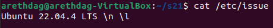 

### Скачать и установить на виртуальную машину **gitlab-runner**

> Был выбран метод установки gitlab-runner через [бинарный файл с официального сайта](https://docs.gitlab.com/runner/install/linux-manually.html)

1. Загрузить бинарный файл 
```sh
sudo curl -L --output /usr/local/bin/gitlab-runner "https://s3.dualstack.us-east-1.amazonaws.com/gitlab-runner-downloads/latest/binaries/gitlab-runner-linux-amd64"
```

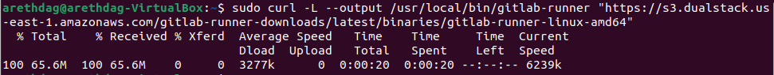

2. Дать файлу разрешение на исполнение: <br>
```sh
sudo chmod +x /usr/local/bin/gitlab-runner
```

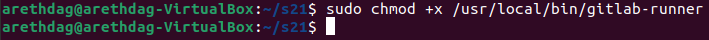

3. Создать пользователя GitLab CI <br>
```sh
sudo useradd --comment 'GitLab Runner' --create-home gitlab-runner --shell /bin/bash
```

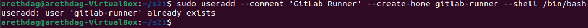

4. Установить как службу <br>
```sh
sudo gitlab-runner install --user=gitlab-runner --working-directory=/home/gitlab-runner
```

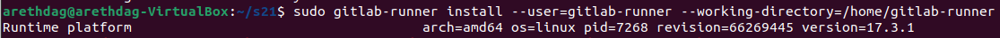

5. Запустить службу
```sh
sudo gitlab-runner start
```

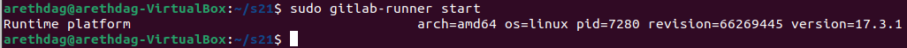 

### Запустить **gitlab-runner** и зарегистрировать его для использования в текущем проекте (*DO6_CICD*)

> Для регистрации понадобятся URL и токен, которые можно получить на страничке задания на платформе

- Зарегистрировать gitlab-runner
```ssh
sudo gitlab-runner register
```
> Для этого необходимо ввести данные при регистрации: <br>
> 1. Cвой URL-адрес GitLab
> 2. Cвой регистрационный токен
> 3. Название раннера
> 4. Теги для заданий, разделенные запятыми
> 5. Тип исполнителя

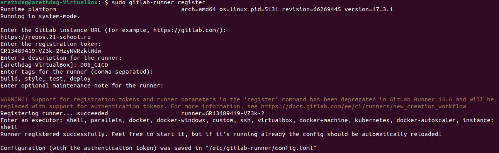 


## Part 2. Сборка

### Напиcать этап для CI по сборке приложений из проекта *C2_SimpleBashUtils*

- В корне репозитория создать файл `.gitlab-ci.yml`

```ssh
touch .gitlab-ci.yml
```

- Добавить в файл этап запуска сборки через мейк файл из проекта C2.

> Настроим также этап, чтобы файлы, полученные после сборки (артефакты), сохранялись со сроком хранения 30 дней.

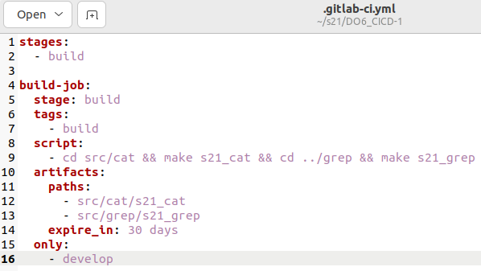

### Неподготовленная оболочка

- При пуше мы столкнемся со следующей ошибкой

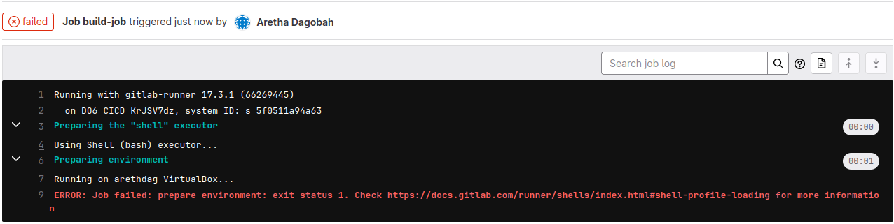

> Раннер нас предупреждает, что среда не подготовлена к запуску. Причиной послужила дефолтная конфигурация gitlab-runner, производящая очистку терминала при выходе из оболочки shell. Комментирование строк данного скрипта устраняет данную ошибку

- Закомментируем строки в `/home/gitlab-runner/.bash_logout`

### Проверка сборки проекта

- Перезапустим пайплайн и проверим пропала ли ошибка


- Как можно увидеть, сборка была успешно осуществлена, исполняемые файлы были сохранены на 30 дней

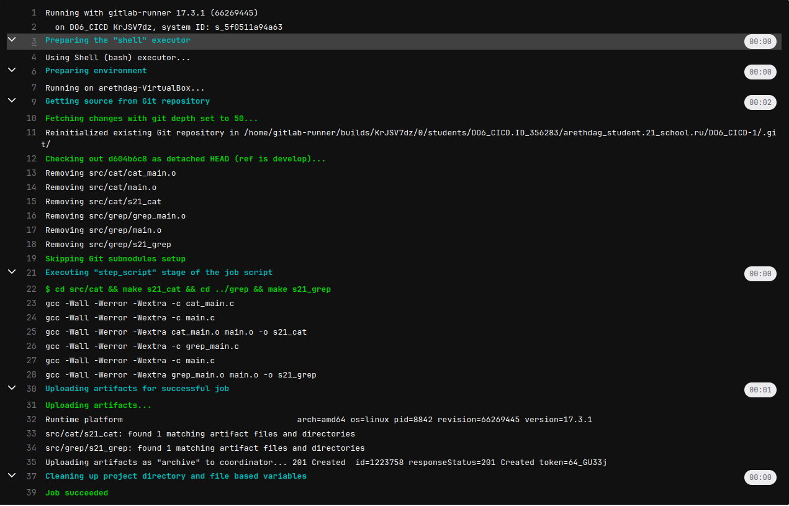


## Part 3. Тест кодстайла

### Напиcать этап для CI, который запускает скрипт кодстайла (clang-format)

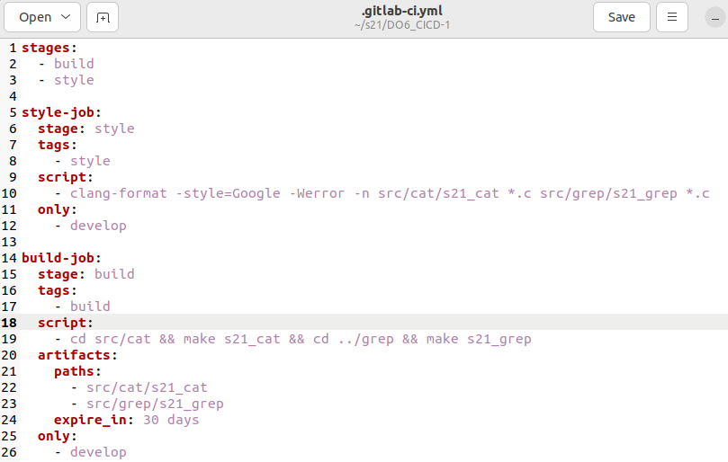

### Проверить зафейлился ли пайплайн, если совершена ошибка в кодстайле

- Проверим сначала вывод команды локально

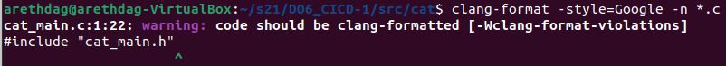

- Как и ожидалось - пайплайн зафейлился

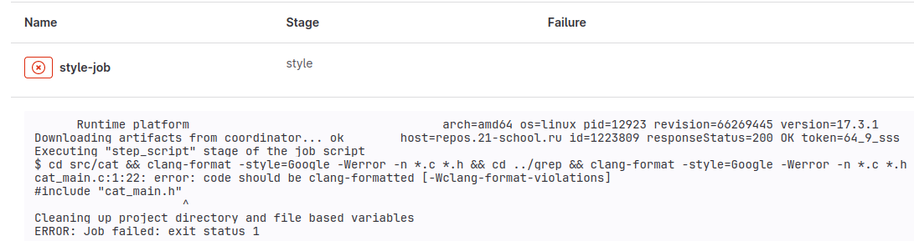

- Вывод пайплайна совпал с локальным выводом команды


### Исправить ошибку в форматировании кода и проверить результат

- Результат работы пайплайна

- Теперь проект успешно проходит тест кодстайла


## Part 4. Интеграционные тесты

### Написать этап для CI, который запускает интеграционные тесты из того же проекта

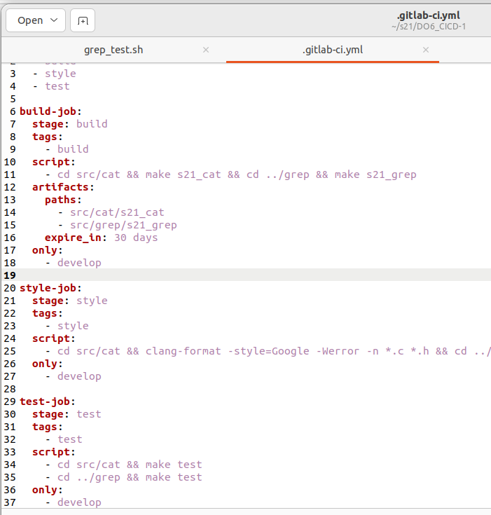

### Проверить зафейлился ли пайплайн, если обнаруживаются ошибочные рузльтаты интеграционных тестов

- Проверим сначала вывод интеграционных тестов локально


- Результат работы пайплайна


- Проект успешно проходит интеграционные тесты

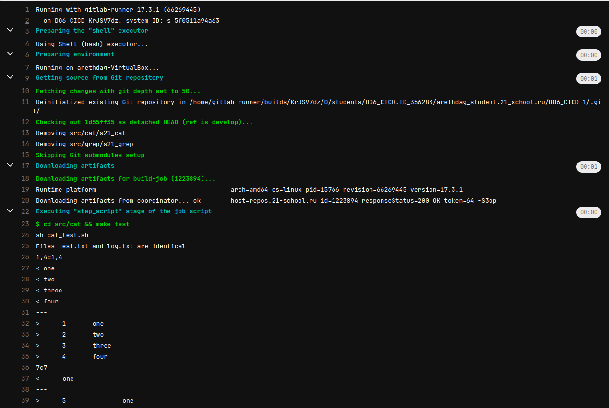

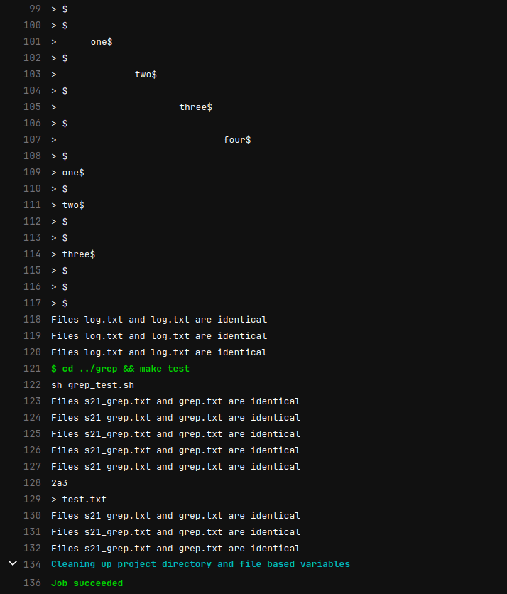


## Part 5. Этап деплоя

### Поднять вторую виртуальную машину Ubuntu Server 22.04 LTS

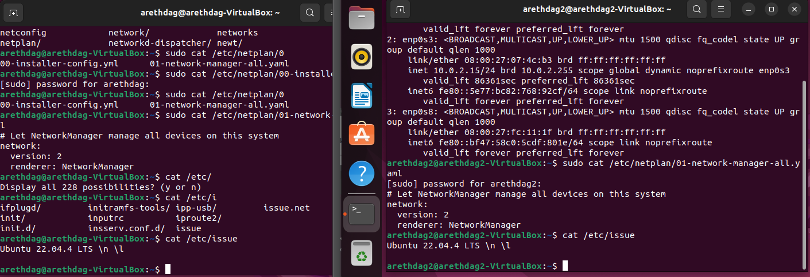

### Статическая маршрутизация между двумя машинами

- Настроим адаптеры обоих машин на внутреннюю сеть

```sh
sudo nano /etc/netplan/00-network-manager-all.yaml
```

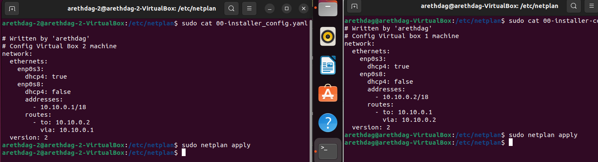

- Обязательно принимаем изменения в настройках адаптеров

```sh
sudo netplan apply
```

- Проверим соединение между машинами

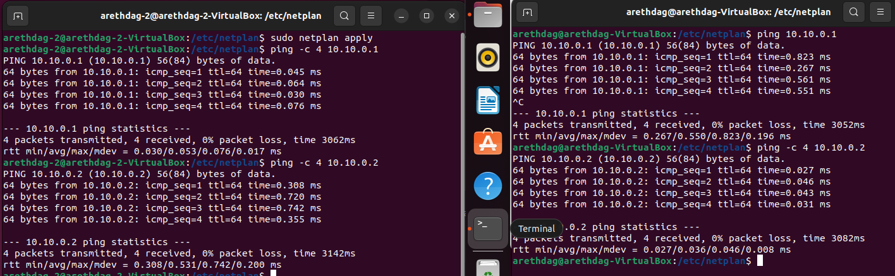

### Генерация ssh-ключей

- Для начала сгенерируем пары ключей для каждой машины

```sh
ssh-keygen
```
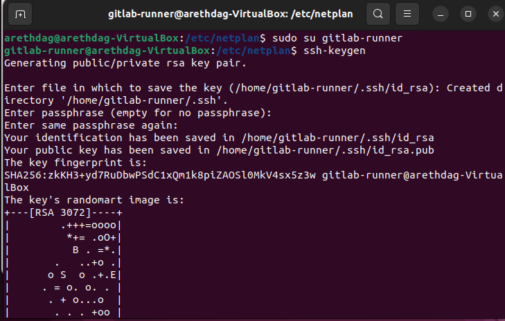

- Добавим открытый ключ второй машины с вывода в ssh ключи gitlab для работы с проектом на удаленной машине

### Написать bash-скрипт, который при помощи ssh и scp копирует файлы, полученные после сборки (артефакты), в директорию /usr/local/bin второй виртуальной машины

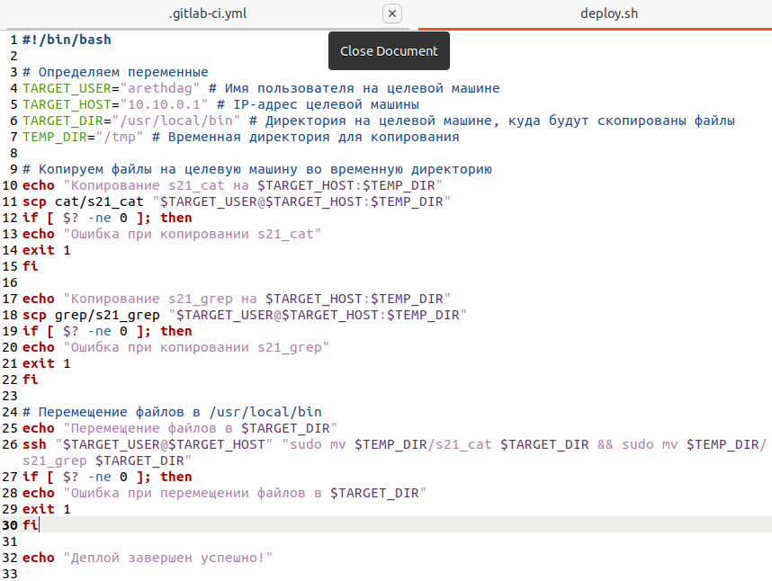

- Проверим выполнение всех предыдущих этапов 

### Написать этап для CD, который «разворачивает» проект на другой виртуальной машине

> Данный этап будет запускаться вручную при условии, что все предыдущие этапы прошли успешно

- Теперь, когда на удаленной машине есть проект, допишем этап деплоя в `.gitlab-ci.yml`

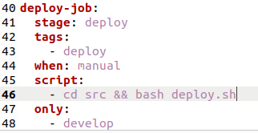

> Этап деплоя описан таким образом, что для получения доступа к удаленному серверу применяется ssh-агент. Для его работы необходимо будет выполнить определенный ряд действий

### Настройка ssh-агента

- Следующие изменения будут происходить от суперпользователя, поэтому сразу же перейдем в этот режим на машине с развернутым раннером

```sh
sudo su
```

- Перейдем в настройки раннера и обозначим ему где искать ssh-агента. Для этого в файле конфигураций добавим строку `environment = ["SSH_AUTH_SOCK=/tmp/ssh-agent"]`

```sh
vim /etc/gitlab-runner/config.toml
```
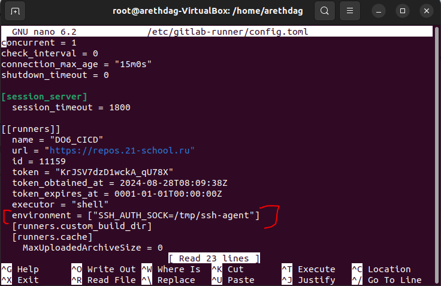

- Далее необходимо сохранить отпечаток удаленного сервера. Для этого ключ удаленного сервера необходимо добавить в файл `known_hosts` в домашнем каталоге пользователя gitlab-runner

```sh
ssh-keyscan -H 192.10.10.2 >> /home/gitlab-runner/.ssh/known_hosts
```
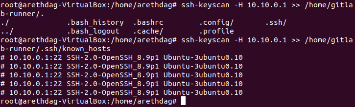

- Так как раннеру необходим приватный ключ, для того, чтобы не возникало проблем с ключами доступа к директории `/home/arethdag/.ssh` и ее содержимому - скопируем закрытый ключ также в домашний каталог пользователя gitlab-runner

```sh
cp /home/arethdag/.ssh/id_rsa /home/gitlab-runner/.ssh/
```
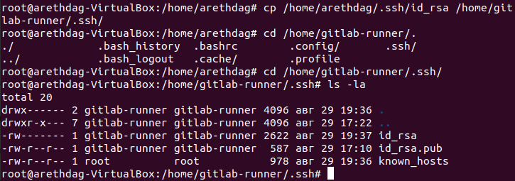

- В домашнем каталоге раннера есть все необходимое, однако на скрине можно заметить - так как мы находимся в режиме суперпользователя, в ключах указан root. Для того, чтобы раннер сумел их счесть, поменяем пользователя на gitlab-runner

- Скопируем содержимое нашего открытого ssh-ключа на удаленный сервер

> Отвечаем `yes` на подтверждение подключения и в следующем действии вводим пароль от удаленной машины

```sh
ssh-copy-id arethdag@192.10.10.2
```
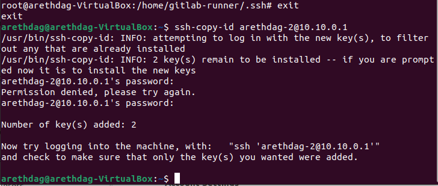

- После успешной настройки ssh-агента есть один небольшой штришок. Так как наш скрипт производит копирование в директорию, в которой у нас нет прав - даем право пользователю (в нашем случае `arethdag`) на проведение команды `mv` (по скрипту необходима команда `mv`) с правами суперпользователя без ввода пароля. Для этого на удаленной машине в файле `/etc/sudoers` допишем строку `arethdag ALL=(ALL) NOPASSWD: /bin/mv`

```sh
sudo visudo
```
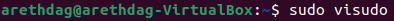

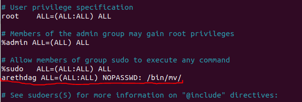

- Теперь можно с уверенностью сказать, что этап деплоя не выдаст ошибок. Перезапустим службу раннера и тем самым закончим настройку ssh-агента

```sh
sudo systemctl restart gitlab-runner.service
```

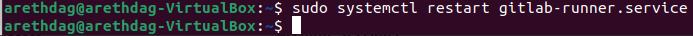

### Проверка этапа деплоя


## [Part 6. Дополнительно. Уведомления](#содержание)

### Настроить уведомления о успешном/неуспешном выполнении пайплайна через бота с именем «arethdag DO6 CI/CD» в Telegram

> Текст уведомления будет содержать информацию об успешности прохождения как этапа CI, так и этапа CD. <br>
> В остальном текст уведомления может быть произвольным.

- Найдем в телеграме через поиск `BotFather`

- Запустим бота и напишем `/newbot`

> В диалоге необходимо будет написать: <br>
> - имя бота `arethdag_bot» в Telegram` <br>
> - используем для бота (имя должно быть уникальным и заканчиваться на `bot`)

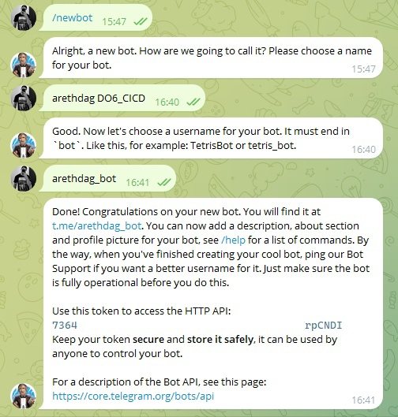

- В результате мы получили `API` бота. Теперь найдем бота `getmyid_bot` и напишем ему `/start` для получения нашего `ID`

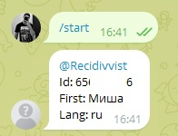

- Пропишем логику работы бота

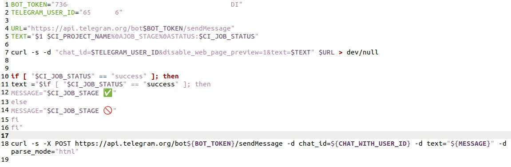

